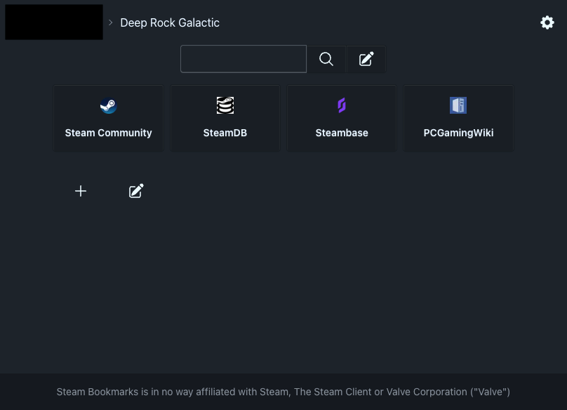

# Steam Bookmarks

Home page for the Steam overlay browser

## What does it do?

After you set Steam Bookmarks as the home page of your Steam overlay browser, opening your browser while playing a game will allow you to set persistent bookmarks for this specific game.

